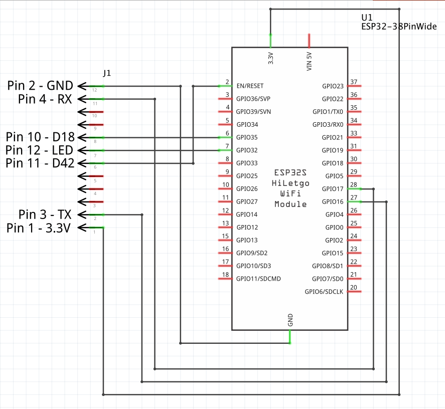
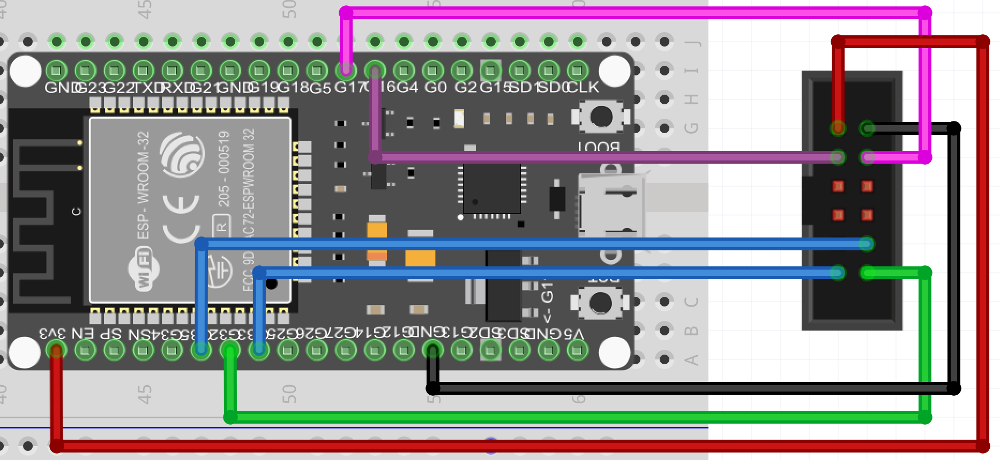

GEVCU - Web
=================
by Michael Neuweiler

A replacement for the buggy GEVCU iChip. Use an ESP32 to connect via the existing serial interface
to the GEVCU. It provides the GEVCU web-site and data via websocket to a web browser.
The big advantages over the default iChip are:
* The operation is much more stable
* The communication is much faster because it's binary between GEVCU and ESP32. Thus the json data
for the web-browser is generated by the ESP32, not GEVCU - off-loading GEVCU from time consuming work
* With SPIFFS' 1.5MB there's three times more space for web-content than on iChip. With an SD card we're talking GB's and the possibility to store and present statistical data.

The configuration of the ESP32 is stored in data/config.json. Adjust it to your own needs. 

Connect with a laptop, mobile phone, tablet or Raspberry Pi to the WiFi network of the ESP32 ("GEVCU" by default) and in a web-browser open http://gevcu.local 

Requires the following libraries:
* ArduinoJson
* ArduinoOTA
* https://github.com/me-no-dev/AsyncTCP
* https://github.com/me-no-dev/ESPAsyncWebServer
* ESPmDNS
* FS
* SD_MMC
* SPIFFS
* Update
* WiFi
* HTTPClient
* WifiClientSecure

Requires the following hardware:
* ESP32 board with GPIO 12-17 exposed - if possible with SD card reader integrated (then only 16,17 are required) - a good choice is https://www.aliexpress.com/item/4000133143167.html
* SD card with FAT filesystem to store the web site data on (you may also use 1.5MB SPIFFS instead).
Upload the contents of the directory "data" to the root of the file system.
* GEVCU (General Electric Vehicle Control Unit) to connect to via Serial2 interface.

Note: To ensure flawless operation, increase the "max_files" config in SD_MMC.cpp from 5 to 20 !
      (in SDMMCFS::begin() , around line 72)

Upload Parameters:
* Board: ESP32 Dev Module
* Upload Speed: 921600
* CPU Freq: 240MHz
* Flash Freq: 80MHz
* Flash Mode: QIO
* Flash Size: 4MB (32Mb)
* Partition Scheme: Default with SPIFFS (1.2MB App, 1.5MB SPIFFS)
* Core Debug Level: none
* PSRAM: disabled
* Port: gevcu at 192.168.3.1 (for over the air update once a working copy has been installed via USB)

The ESP32 must be connected the following way to GEVCU's wifi/iChip socket:

With a simple adapter you can plug the esp3 board right into the original socket:

